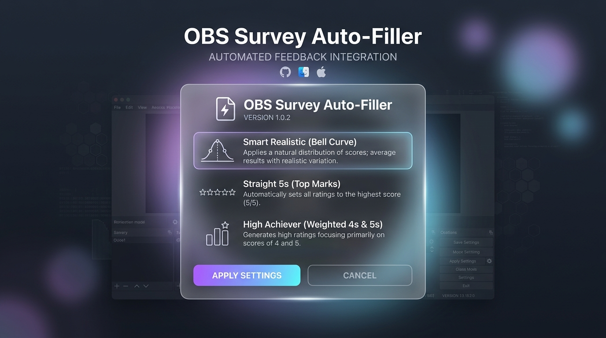
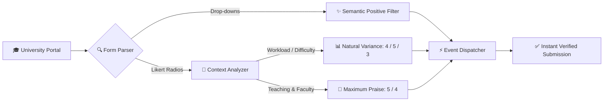

<p align="center">
  
</p>

# OBS Survey Auto-Filler

<p align="left">
  
  
  
  
  
</p>

An intelligent, distraction-free browser extension designed to effortlessly auto-fill university course and faculty evaluation surveys (OBS, EBS, BYS, and similar academic portals) in seconds.

Engineered with an **iOS Liquid Frosted Glass** interface, pure **hollow outline vector icons**, and native **Apple San Francisco typography**.

---

## ✦ Key Capabilities

<table>
  <tr>
    <td width="50%">
      <h3>🧠 Smart Realistic Mode</h3>
      <p>Employs contextual probability modeling (Bell Curve) to distinguish between demanding workload questions and teaching quality. Prevents algorithmic flags for automated straight-lining while rewarding instructors.</p>
    </td>
    <td width="50%">
      <h3>💧 iOS Liquid Glass Aesthetic</h3>
      <p>Multi-layered translucent frosted glass (<code>backdrop-filter: blur(32px)</code>), specular edge reflections, tactile spring physics, and zero consumer emojis.</p>
    </td>
  </tr>
  <tr>
    <td width="50%">
      <h3>🌐 Bilingual Interface (EN ⇄ TR)</h3>
      <p>Instant one-click toggle between English and Turkish across all modal interfaces, toolbar popups, settings, and toast notifications.</p>
    </td>
    <td width="50%">
      <h3>👁️ Floating Pill Visibility Control</h3>
      <p>Freedom to hide or display the bottom-right launcher pill anytime. Control surveys directly from the browser toolbar if you prefer a clean canvas.</p>
    </td>
  </tr>
  <tr>
    <td width="50%">
      <h3>✨ Context-Aware Drop-Downs</h3>
      <p>Automatically scans student background and study hours drop-downs to select top-tier positive options (<em>"Çok Fazla"</em>, <em>"Fazlasıyla Yeterliydi"</em>).</p>
    </td>
    <td width="50%">
      <h3>🌙 Persistent Dark & Light Themes</h3>
      <p>Seamlessly toggle between Slate Dark Glass and Crystal Frosted Light Glass with persistent local synchronization.</p>
    </td>
  </tr>
</table>

---

## ✦ Intelligent Evaluation Flow

The diagram below outlines how the extension processes questions, analyzes context, and dispatches native browser events:



---

## ✦ Strategy Matrix

| Strategy | Glyph | Target Score | Distribution Characteristics | Recommended Use Case |
| :--- | :---: | :---: | :--- | :--- |
| **Smart Realistic** | ✦ | ~4.68 | Context-aware variance (Workload: 4/5/3; Teaching: 5/4) | **Standard Evaluations (Recommended)**. Resists automated anomaly audits while giving instructors top marks. |
| **Straight 5s** | ★ | 5.00 | 100% score of 5 on all Likert questions | Maximum positive feedback for exceptional educators. |
| **High Achiever** | ↗ | ~4.80 | Uniform 80% 5s / 20% 4s split | High praise with light natural variance. |
| **Solid 4s** | ✓ | 4.00 | Uniform score of 4 across all questions | Balanced, consistently positive evaluation. |
| **Randomize** | ⇄ | ~3.00 | Even random sampling between 1 and 5 | Testing or simulated mixed student feedback. |

---

## ✦ User Guide & Workflows

Evaluating 8–10 courses at the end of each semester can take 30+ minutes of repetitive clicking. With OBS Survey Auto-Filler, you can complete all evaluations in under 60 seconds:

### 1. Open the Survey Form
Log into your university's Student Information System (OBS, EBS, BYS, Proliz, etc.) and navigate to any active Course & Faculty Evaluation Survey.

### 2. Launch the Auto-Fill Widget
You have two convenient ways to access the controls:
- **In-Page Floating Pill:** Click the translucent **Auto-Fill** pill in the bottom-right corner of your screen.
- **Browser Toolbar Menu:** Click the extension icon in your browser's toolbar.

### 3. Select an Evaluation Strategy
Click any strategy button (e.g. **Smart Realistic** or **Straight 5s**). The extension will:
- Instantly answer all Likert radio groups according to the chosen probability distribution.
- Automatically select positive options in student background drop-downs.
- Fire native DOM events (`input`, `change`, `click`) to ensure the university web application registers the state changes.
- Highlight each completed question with a subtle glow animation for visual verification.
- Display a clean confirmation toast stating the exact number of answered items.

### 4. Optional Automation Toggles
- **Smart fill student drop-downs:** Automatically selects positive responses for student-specific questions.
- **Auto-click Save/Submit button:** Automatically triggers the form submission 500ms after filling, allowing you to advance to the next course immediately.
- **Show floating button on pages:** Hide the bottom-right pill if you prefer a completely clean page and want to trigger fills exclusively from the toolbar icon.

---

## ✦ Installation

### Supported Browsers
Google Chrome, Brave, Microsoft Edge, Opera, Vivaldi, and any Chromium-based browser.

### Setup Instructions
1. **Clone or Download** this repository:
   ```bash
   git clone https://github.com/ertandev/obs-survey-autofill.git
   ```
2. Open your browser's extensions management page:
   - **Chrome / Brave:** `chrome://extensions`
   - **Edge:** `edge://extensions`
3. Enable **Developer mode** (toggle switch in the top-right corner).
4. Click **Load unpacked** (button in the top-left corner).
5. Select the `obs-survey-autofill` folder.
6. Return to your university survey tab — the widget will activate automatically.

---

## ✦ Instant Console Script (Zero-Install)

If you are using a university computer or cannot install extensions, paste this standalone script directly into your browser's developer console:

1. Press `F12` (or right-click ➔ **Inspect**) and navigate to the **Console** tab.
2. Paste the snippet below and press `Enter`:

```javascript
(() => {
  const pKw1 = ['çok fazla', 'fazlasıyla yeterliydi', 'fazlasıyla', 'kesinlikle katılıyorum'];
  const pKw2 = ['yeterliydi', 'yeterli', 'fazla', 'çok iyi', 'katılıyorum'];
  let count = 0;
  const radios = Array.from(document.querySelectorAll('input[type="radio"]'));
  const groups = new Map();
  radios.forEach(r => {
    const k = r.name || r.closest('tr') || r.parentElement;
    if (!groups.has(k)) groups.set(k, []);
    groups.get(k).push(r);
  });
  groups.forEach(list => {
    const rowText = (list[0].closest('tr')?.innerText || '').toLowerCase();
    const isWorkload = /iş yükü|zaman|çalışma|saat|okuma|akts|ödev/.test(rowText);
    let targetScore = 5;
    if (isWorkload) {
      const r = Math.random();
      targetScore = r < 0.48 ? 4 : (r < 0.82 ? 5 : 3);
    } else {
      const r = Math.random();
      targetScore = r < 0.76 ? 5 : (r < 0.96 ? 4 : 3);
    }
    let target = list.find(r => r.value == targetScore) || list.find(r => (r.parentElement?.textContent || '').includes(String(targetScore))) || list[0];
    if (target) {
      target.checked = true;
      target.dispatchEvent(new Event('input', { bubbles: true }));
      target.dispatchEvent(new Event('change', { bubbles: true }));
      target.dispatchEvent(new MouseEvent('click', { bubbles: true }));
      count++;
    }
  });
  document.querySelectorAll('select').forEach(sel => {
    const opts = Array.from(sel.options).filter(o => o.value && !o.text.toLowerCase().includes('seçiniz'));
    const t1 = opts.find(o => pKw1.some(k => o.text.toLowerCase().includes(k)));
    const t2 = opts.find(o => pKw2.some(k => o.text.toLowerCase().includes(k)));
    const chosen = (t1 && t2) ? (Math.random() < 0.7 ? t1 : t2) : (t1 || t2 || opts[0]);
    if (chosen) {
      sel.value = chosen.value;
      sel.dispatchEvent(new Event('change', { bubbles: true }));
      count++;
    }
  });
  alert(`${count} survey questions filled successfully!`);
})();
```

---

## ✦ Frequently Asked Questions

<details>
<summary><b>Will the university detect automated completion?</b></summary>
<p>
When using <b>Smart Realistic</b> mode, evaluations appear statistically authentic. The extension introduces natural variance: demanding workload questions receive realistic scores (4s and 3s) while teaching delivery receives top marks (5s). Because this mirrors genuine human behavior, it does not trigger straight-lining heuristic alarms.
</p>
</details>

<details>
<summary><b>Is student data or survey content transmitted externally?</b></summary>
<p>
No. The extension operates entirely offline within the browser runtime. There are zero tracking beacons, telemetry endpoints, or third-party connections. You can inspect the source code in <code>content.js</code>.
</p>
</details>

<details>
<summary><b>How does it resolve reversed Likert scales (1 on left, 5 on right)?</b></summary>
<p>
The parsing engine inspects explicit input values, labels, and adjacent text nodes matching digits 1 through 5 before falling back to position. It accurately selects the intended rating regardless of horizontal order.
</p>
</details>

<details>
<summary><b>How do I hide the floating button?</b></summary>
<p>
Uncheck <i>Show floating button on pages</i> in the panel settings or from the toolbar popup. The widget will hide immediately, and you can still trigger evaluations from the toolbar icon anytime.
</p>
</details>

---

## ✦ Repository Structure

```
obs-survey-autofill/
├── assets/             # Showcase banners and graphic assets
│   └── banner.png
├── manifest.json       # Manifest V3 configuration & permission schema
├── content.js          # Core evaluation engine, i18n & DOM dispatchers
├── content.css         # iOS Liquid Glass styling & San Francisco typography
├── popup.html          # Browser toolbar interface
├── popup.js            # Toolbar message controller & state sync
├── icons/              # Extension icons (16px, 48px, 128px)
└── scripts/            # Build & icon generation utilities
```

---

## ✦ License

This project is licensed under the [MIT License](LICENSE).
